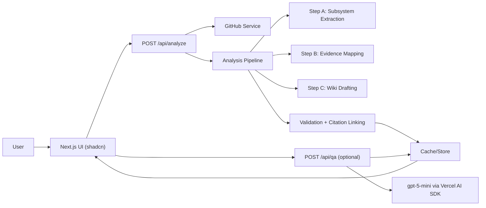

# Cubic Wiki Generator
## Final System Architecture (48h Pragmatic Build)

This document defines a production-feeling architecture for the coding challenge:
- Fully aligned with the challenge constraints
- Optimized for fast execution (about 5 focused hours)
- Strong on AI output quality, citation correctness, and UX clarity

---

## 1. Challenge Alignment

The implementation is explicitly designed to satisfy `./challenge-cubic/raw_challenge.md`:

- User-facing, feature-driven subsystem discovery (not technical layers)
- Machine-readable subsystem output
- Human-readable wiki pages per subsystem
- Inline citations linking to exact repo files and line ranges
- Public deploy with zero local setup
- Optional Q&A over generated wiki content
- OpenAI model stays on `gpt-5-mini`

---

## 2. Stack (Required + Recommended)

- Framework: `Next.js 15` (App Router, Route Handlers)
- UI: `Tailwind CSS` + `shadcn/ui`
- AI runtime: `Vercel AI SDK` (`ai`, `@ai-sdk/openai`)
- Validation: `Zod`
- GitHub API: `Octokit` (or wrapped `fetch`)
- Markdown rendering: `react-markdown` + `remark-gfm`
- Persistence:
  - MVP: in-memory + optional Vercel KV cache
  - Upgrade path: Vercel Postgres + pgvector (only if time remains)
- Deployment: `Vercel`

---

## 3. Design Principles

1. Accuracy over novelty: every technical claim should be evidence-backed.
2. Deterministic outputs: validate every LLM boundary with Zod.
3. Controlled scope: ship end-to-end first, then add optional Q&A polish.
4. Fast feedback loops: parallel wiki page generation by subsystem.
5. Stable citations: anchor links to commit SHA, not moving branch HEAD.

---

## 4. High-Level Architecture



---

## 5. Repository Structure

```txt
.
├─ src/
│  ├─ app/
│  │  ├─ page.tsx
│  │  ├─ repo/[projectId]/page.tsx
│  │  ├─ repo/[projectId]/[slug]/page.tsx
│  │  └─ api/
│  │     ├─ analyze/route.ts
│  │     ├─ repo/[projectId]/route.ts
│  │     ├─ page/[pageId]/route.ts
│  │     └─ qa/route.ts
│  ├─ components/
│  │  ├─ repo-form.tsx
│  │  ├─ wiki-sidebar.tsx
│  │  ├─ wiki-content.tsx
│  │  ├─ citation-link.tsx
│  │  └─ qa-panel.tsx
│  ├─ lib/
│  │  ├─ github/
│  │  │  ├─ client.ts
│  │  │  ├─ filters.ts
│  │  │  └─ types.ts
│  │  ├─ ai/
│  │  │  ├─ client.ts
│  │  │  ├─ prompts.ts
│  │  │  ├─ schemas.ts
│  │  │  └─ pipeline.ts
│  │  ├─ citations/
│  │  │  ├─ line-numbering.ts
│  │  │  └─ parser.ts
│  │  ├─ store/
│  │  │  ├─ memory.ts
│  │  │  └─ kv.ts
│  │  └─ utils/
│  │     ├─ repo-url.ts
│  │     └─ logger.ts
├─ ARCHITECTURE_FINAL.md
└─ README.md
```

---

## 6. Core Data Contracts (Zod-First)

All LLM outputs must pass strict schema validation.

```ts
import { z } from "zod";

export const SubsystemSchema = z.object({
  id: z.string().regex(/^[a-z0-9-]+$/),
  name: z.string().min(3),
  description: z.string().min(10),
  userJourney: z.string().min(20),
  relevantPaths: z.array(z.string()).min(1),
  entryPoints: z.array(z.string()).min(1).max(3),
  externalServices: z.array(z.string()).default([]),
});

export const SubsystemListSchema = z.object({
  productSummary: z.string().min(10),
  subsystems: z.array(SubsystemSchema).min(3).max(8),
});

export const CitationSchema = z.object({
  path: z.string(),
  startLine: z.number().int().positive(),
  endLine: z.number().int().positive(),
  url: z.string().url(),
});

export const WikiPageSchema = z.object({
  subsystemId: z.string(),
  subsystemName: z.string(),
  markdown: z.string().min(100),
  citations: z.array(CitationSchema),
});
```

Validation rules:
- Reject subsystem names like `frontend`, `backend`, `api`, `utils`.
- Reject citations to files not present in fetched repo index.
- Enforce `startLine <= endLine`.

---

## 6.1 Database Schema (Postgres)

Use this schema if you choose Postgres instead of in-memory/KV-only storage.

### `projects`
- `id` UUID PK
- `repo_owner` TEXT NOT NULL
- `repo_name` TEXT NOT NULL
- `default_branch` TEXT NOT NULL
- `head_sha` TEXT NOT NULL
- `status` TEXT NOT NULL CHECK (`pending`, `analyzing`, `ready`, `error`)
- `product_summary` TEXT
- `error_message` TEXT
- `created_at` TIMESTAMPTZ NOT NULL DEFAULT now()
- `updated_at` TIMESTAMPTZ NOT NULL DEFAULT now()

Indexes:
- Unique: (`repo_owner`, `repo_name`, `head_sha`)
- B-tree: (`status`)

### `subsystems`
- `id` UUID PK
- `project_id` UUID NOT NULL FK -> `projects(id)` ON DELETE CASCADE
- `slug` TEXT NOT NULL
- `title` TEXT NOT NULL
- `description` TEXT NOT NULL
- `user_journey` TEXT NOT NULL
- `external_services` JSONB NOT NULL DEFAULT `[]`
- `sort_order` INT NOT NULL
- `created_at` TIMESTAMPTZ NOT NULL DEFAULT now()

Indexes:
- Unique: (`project_id`, `slug`)
- B-tree: (`project_id`, `sort_order`)

### `wiki_pages`
- `id` UUID PK
- `project_id` UUID NOT NULL FK -> `projects(id)` ON DELETE CASCADE
- `subsystem_id` UUID NOT NULL FK -> `subsystems(id)` ON DELETE CASCADE
- `markdown_raw` TEXT NOT NULL
- `markdown_rendered` TEXT NOT NULL
- `toc_json` JSONB NOT NULL DEFAULT `[]`
- `created_at` TIMESTAMPTZ NOT NULL DEFAULT now()
- `updated_at` TIMESTAMPTZ NOT NULL DEFAULT now()

Indexes:
- Unique: (`project_id`, `subsystem_id`)
- B-tree: (`project_id`)

### `citations`
- `id` UUID PK
- `page_id` UUID NOT NULL FK -> `wiki_pages(id)` ON DELETE CASCADE
- `path` TEXT NOT NULL
- `start_line` INT NOT NULL
- `end_line` INT NOT NULL
- `label` TEXT NOT NULL
- `url` TEXT NOT NULL
- `created_at` TIMESTAMPTZ NOT NULL DEFAULT now()

Constraints:
- CHECK (`start_line` > 0)
- CHECK (`end_line` >= `start_line`)

Indexes:
- B-tree: (`page_id`)
- B-tree: (`path`)

### `analysis_runs` (optional but recommended)
- `id` UUID PK
- `project_id` UUID NOT NULL FK -> `projects(id)` ON DELETE CASCADE
- `step` TEXT NOT NULL
- `status` TEXT NOT NULL CHECK (`running`, `success`, `error`)
- `input_json` JSONB
- `output_json` JSONB
- `token_usage_json` JSONB
- `started_at` TIMESTAMPTZ NOT NULL DEFAULT now()
- `finished_at` TIMESTAMPTZ

Indexes:
- B-tree: (`project_id`, `started_at`)

---

## 7. GitHub Service Layer

Create a dedicated service in `src/lib/github/client.ts`:

- Parse repo URL (`owner/repo`)
- Fetch default branch and latest commit SHA
- Fetch recursive tree
- Fetch selected file contents (with caps and retries)
- Build stable GitHub permalink URLs:
  - `https://github.com/{owner}/{repo}/blob/{sha}/{path}#L10-L30`

File selection strategy:
- Exclude: binaries, generated/build folders, lockfiles, large media
- Clean tree paths before AI selection (drop invalid segments like `.agents`, `.claude`, `tests`, `.coverage`, `node_modules`)
- Let AI select high-signal files from the filtered tree (works across app/system repos)
- Send the full cleaned tree path list to AI (no hardcoded small path-count limit)
- Validate selected paths exist in the tree before fetching content
- Cap content by line budget and byte budget per subsystem

---

## 8. AI Pipeline (3 Main Steps)

### Step A: Subsystem Extraction
Input:
- File tree
- AI-selected signal files from the filtered tree

Output:
- JSON subsystem map (Zod-validated)

LLM constraints:
- Organize by user-facing capabilities
- No technical-layer subsystem names
- 3 to 8 subsystems only

### Step B: Evidence Mapping
For each subsystem, map:
- Relevant source files
- Exact evidence ranges (`path + line start/end`)

Server validates that:
- Path exists
- Lines exist in file

### Step C: Wiki Drafting
Generate markdown page per subsystem with sections:
- Overview
- How It Works
- User Flow
- Entry Points
- Data Models
- External Dependencies
- Gotchas

Every technical claim must include citation markers.

Run subsystem drafting in parallel (`Promise.all`) to reduce latency.

---

## 9. Citation Correctness Strategy (Critical)

To prevent citation drift:

1. Add line numbers before truncation:
   - Keep true source line numbers in prompt context.
2. Truncate with head/tail windows:
   - Keep meaningful context while staying inside token budget.
3. Render citation URLs with commit SHA:
   - Use immutable link targets.
4. Post-validate citations:
   - Remove or flag citations that fail path/line validation.

This is a primary differentiator for evaluator trust.

---

## 10. API Contract

### `POST /api/analyze`
Input:
```json
{ "repoUrl": "https://github.com/tastejs/todomvc" }
```
Output:
```json
{ "projectId": "uuid", "status": "analyzing" }
```

### `GET /api/repo/:projectId`
Returns:
- Project summary
- Subsystem list
- Generation status

### `GET /api/page/:pageId`
Returns:
- Markdown content
- Parsed citations

### `POST /api/qa` (optional)
Input:
```json
{ "projectId": "uuid", "question": "How does authentication work?" }
```
Output:
```json
{ "answer": "...", "citations": [...] }
```

---

## 11. UI/UX Plan (shadcn)

### Screen 1: Analyze
- `Input` for GitHub URL
- `Button` to start
- `Card` with status and validation errors

### Screen 2: Wiki Viewer
- Left `ScrollArea` sidebar with subsystem navigation + search
- Main markdown viewer
- Citation chips/links near claims

### Screen 3: Optional Q&A
- `Sheet` or side panel chat
- Streamed response with citation links

Components to use:
- `Button`, `Input`, `Card`, `Separator`, `ScrollArea`, `Skeleton`, `Badge`, `Sheet`

UX quality requirements:
- Never show blank waiting screen
- Always show progress state (`Fetching -> Analyzing -> Writing -> Ready`)
- Friendly, explicit errors for invalid repo or rate limits

---

## 12. Error Handling and Reliability

- GitHub rate limit handling (retry/backoff, clear message)
- LLM malformed JSON:
  - Auto-retry once with repair prompt
  - Hard-fail with structured error if still invalid
- Partial generation:
  - Persist successful pages
  - Surface warnings in UI
- Timeouts:
  - Per-step timeout budget to avoid hanging requests

---

## 13. Security and Secrets

Environment variables:
- `OPENAI_API_KEY` (challenge key, server-side only)
- `GITHUB_TOKEN` (optional, better API limits)
- `KV_REST_API_URL` and `KV_REST_API_TOKEN` (optional cache)

Rules:
- Never expose secrets in client components
- Never log full secret values
- Keep OpenAI calls strictly in server routes/actions

---

## 14. Performance and Cost Controls

- Cache output by `{owner, repo, commitSha}`
- Limit number of files and lines per subsystem context
- Parallelize subsystem wiki generation
- Keep `temperature` low for structured tasks
- Use `gpt-5-mini` for all challenge-related calls

---

## 15. Practical Implementation Plan (48h Window)

### Phase 1 (Core pipeline, ~2.5h)
1. Bootstrap Next.js + Tailwind + shadcn
2. Build repo input + `POST /api/analyze`
3. Implement GitHub service and file filtering
4. Implement subsystem extraction with Vercel AI SDK + Zod

### Phase 2 (Wiki generation, ~1.5h)
1. Add evidence mapping and citation validation
2. Generate wiki markdown per subsystem
3. Build wiki viewer with sidebar + markdown rendering

### Phase 3 (Polish + deploy, ~1h)
1. Loading states and robust error UX
2. Cache by commit SHA
3. Optional Q&A endpoint
4. Deploy to Vercel and validate with multiple repos

---

## 16. Definition of Done

- Public URL works without local setup
- User enters GitHub URL and gets full wiki
- Subsystems are feature-driven and user-facing
- Pages include meaningful technical detail
- Citations link to exact files and line ranges (stable SHA links)
- LLM boundaries are Zod-validated
- Code is lint-clean and commits narrate reasoning

---

## 17. What Makes This Submission Strong

1. Tight challenge compliance (`gpt-5-mini`, user-facing structure, deploy-ready)
2. Citation integrity (line numbering + SHA permalinks + validation)
3. Reliable AI outputs (schema-first with retries and guardrails)
4. Strong product polish (clean shadcn UI, clear loading/errors, easy navigation)
5. Clear tradeoff control (MVP first, optional Q&A enhancements second)
